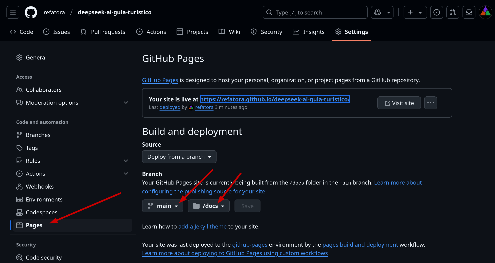

# deepseek-ai-guia-turistico
Crie um website de guia turístico com Deepseek AI.

Neste projeto, desenvolveremos tudo do zero. Vamos construir um website que oferece guias turísticos para diversas cidades brasileiras, utilizando inteligência artificial (IA) com a tecnologia Llama, TypeScript e hospedado no GitHub Pages.

## Demo

Este projeto está hospedado no GitHub Pages: https://refatora.github.io/deepseek-ai-guia-turistico

## Requisitos

* [git](https://git-scm.com/book/en/v2/Getting-Started-Installing-Git)
* [Node Version Manager (nvm)](https://github.com/nvm-sh/nvm?tab=readme-ov-file#installing-and-updating) ou [NodeJs](https://nodejs.org/en/download)
* [Docker](https://docs.docker.com/engine/install/)

## Preparar o Projeto

Baixe os seguintes arquivos em sua máquina:

* Definição do projeto: [package.json](./package.json) 
* Configuração do Typescript: [tsconfig.json](tsconfig.json)
* Versão do Node case utilize Node Version Manager (opcional): [.nvmrc](/.nvmrc) 
* Configuração do Prettier (opcional): [.prettierrc](.prettierrc) e o [.prettierignore](.prettierignore)

Crie o diretório `src` para armazenar o código-fonte:

```sh
mkdir src
```

Instale as dependências:

```sh
npm install
```

Teste o prejeto:

```sh
npm run test

# This is a test, see package.json
```

### Inicie o Servidor Llama Rodando Deepseek AI

Siga os passos do [vídeo anterior](https://youtu.be/MC5FCJ9DWvw) para iniciar o servidor Llama com Deepseek em sua máquina. [Ou siga estas instruções](https://github.com/refatora/deepseek-docker)

## Desenvolvimento do Projeto

### Crie a Lista de Cidades Brasileiras

Para referencia, baixe o arquivo [Estimativas de População do IBGE](https://ftp.ibge.gov.br/Estimativas_de_Populacao/Estimativas_2021/).

Crie um arquivo JSON contendo os dez cidades mais populosas:
[/.resources/cities.json](./resources/cities.json)
```json
[
  {
    "name": "São Paulo",
    "nameNormalized": "sao-paulo",
    "region": "SP"
  },
  {
    "name": "Rio de Janeiro",
    "nameNormalized": "rio-de-janeiro",
    "region": "RJ"
  }
  // ...
}
```

### Criação do Conteúdo Turístico das Cidades

Implemente a funcionalidade que vai gerar o guia turístico de cada cidade.

Crie o arquivo [./src/make-cities-content.ts](./src/make-cities-content.ts) que vai ler o arquivo [./resources/cities.json](./resources/cities.json). Para cada cidade, envie um prompt para o Llama gerar um guia turístico e salve o conteúdo em um arquivo HTML em [./resources/content/](./resources/content/). Utilize o campo `nameNormalized` para o nome do arquivo. Por exemplo `sao-paulo.html`.

Crie o diretório `./resources/content`:

```sh
mkdir resources/content
```

Crie um script de execução que vai ser chamado com:

```sh
npm run make-cities-content
```

### Criação do Layout Padrão

Crie o layout padrão em [./resources/layout/layout.html](./resources/layout/layout.html) que deve incluir um link para a página inicial `./index.html` e uma marcação `{{CONTENT}}` que posteriormente será substituído com o conteúdo de cada página. Outros arquivos de layout podem ser salvos no diretório [./resources/layout](./resources/layout/).

### Criação da Página Inicial

Implemente a funcionalidade que criará a páginina inicial.

Crie o arquivo [./src/make-index-page.ts](./src/make-index-page.ts) que copia o directório [./resources/layout/](./resources/layout/) para [.docs/](./docs/). Leia or arquivos [./resources/cities.json](./resources/cities.json) e [./resources/layout/layout.html](./resources/layout/layout.html) e crie uma lista de links para cada cidade e substitua pela marcação `{{CONTENT}}` do arquivo de layout. Por exemplo:

```html
<p><a href="sao_paulo.html">São Paulo</a></p>
<p><a href="rio_de_janeiro.html">Rio de Janeiro</a></p>
` ...
```

Escreva o resultado em [./docs/index.html](./docs/index.html).

Crie o diretório `./docs`:

```sh
mkdir docs
```

Crie um script de execução:

```sh
npm run make-index-page
```

### Geração do Guia Turístico

Implemente a funcionalidade que criará a página de guia turístico de cada cidades.

Crie o arquivo [./src/make-cities-pages.html](./src/make-cities-pages.ts) e leia os arquivos
[./resources/cities.json](./resources/cities.json) e [./resources/layout.html](./resources/layout.html).
Para cada cidade, leia o conteúdo correspondent do diretório [./resources/content](./resources/content/) e
substitua pela marcação `{{CONTENT}}` do arquivo de layout.

Escreva o resultado em [./docs/](./docs/).
Por exemplo, para a cidade `São Paulo`, crie o arquivo `./docs/sao-paulo.html`.

Crie um script de execucão:

```sh
npm run make-cities-pages
```

### Github Pages

Configure o github repositorio como na imagem abaixo:



Adicione um script no `package.json`:
```json
{
  "scripts": {
    "deploy": "gh-pages -d docs"
  }
}
```

Rode o script:
```sh
npm run deploy
```

# Referencias

- [How to Setup a TypeScript + Node.js Project](https://khalilstemmler.com/blogs/typescript/node-starter-project/)/

- [Crowds Get Ghosted by Fake Halloween Parade Invented on Social Media](https://www.pcmag.com/news/crowds-get-ghosted-by-fake-halloween-parade-invented-on-social-media)